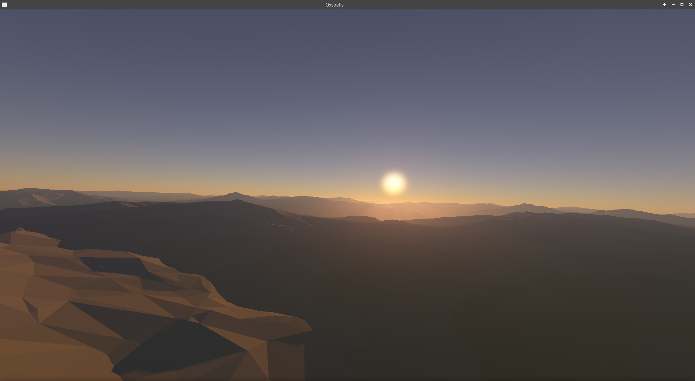
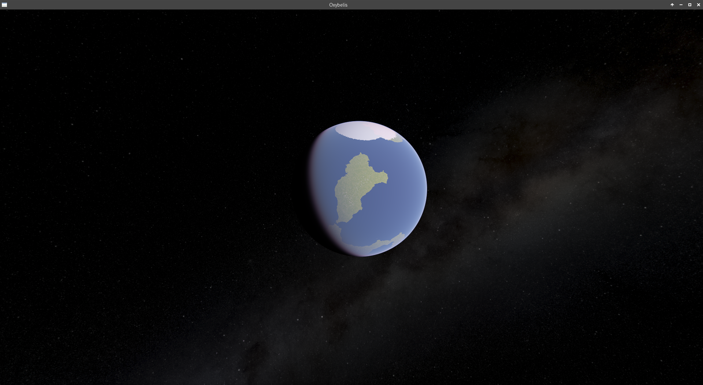
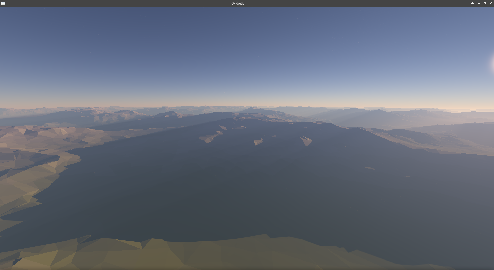
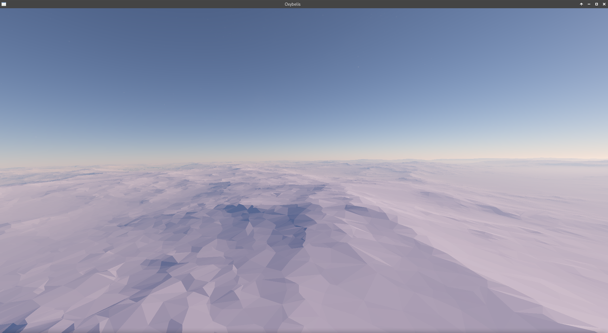
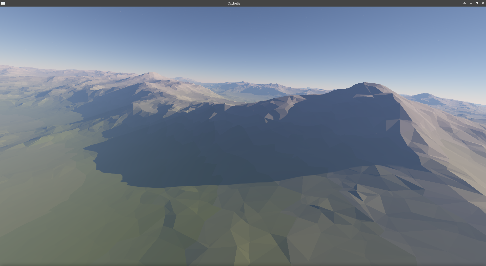

# Oxybelis - OpenGL planet renderer

## Compilation

To compile this project, simply run `make` in the project root. The executable can be found in
`build/target/`, or can be run directly using `make run`.

## Dependencies

On linux, the project has no dependencies except for X11 and GL, as a GLFW static library is included.
On windows, GLFW must be provided by the system.

## Controls

Left mouse button - click window to enable controls, click again to release the mouse.

When the controls are enabled:
Mouse movement to control camera pitch and yaw.
Q/E to control camera roll.
W/S to move forward and backwards.
A/D to move right and left.
Space/Shift to move up and down.
Keyboard arrow up/down to speed camera up and slow down.
Esc to quit.

## AMD

On AMD cards (at least on mine) the program occasionaly shows a black screen or artefacts on linux. In that
case please restart the program until it is fixed. On windows, however, it doesnt work at all. Other cards should be
fine.

## Screenshots

## References & Credits

Eric Bruneton, Fabrice Neyret. Precomputed Atmospheric Scattering. Computer Graphics
Forum, Wiley, 2008, Special Issue: Proceedings of the 19th Eurographics Symposium on Rendering
2008, 27 (4), pp.1079-1086.

Franklin Crow, 1977, Shadow algorithms for computer graphics, In Proc. SIGGRAPH, ACM Press, ACM, 242–248.

Brano Kemen, 2009, "Outerra: Logarithmic Depth Buffer".
    https://outerra.blogspot.com/2009/08/logarithmic-z-buffer.html

Eric Bruneton, 2017, "Precomputed Atmospheric Scattering: a New Implementation".
    https://ebruneton.github.io/precomputed_atmospheric_scattering/

Eugene Hopkinson, "VoxelStorm".
    http://voxelstorm.com/

Gianni Milanesi, "A 2D constrained Delaunay triangulation library”.
    https://github.com/MetricPanda/fast-poly2tri

Lode Vandevenne, "LodePNG".
    https://lodev.org/lodepng/

Camilla Lowy, Marcus Geelnard & contributors, "GLFW - An OpenGL library".
    https://www.glfw.org/

Jason Bevins, 2003-2007, "libnoise: a portable, open-source, coherent noise-generating library for C++".
    http://libnoise.sourceforge.net/index.html

David Herberth & contributors, ”Multi-Language Vulkan/GL/GLES/EGL/GLX/WGL Loader-Generator based on the official specs”.
    https://glad.dav1d.de/

darth_biomech, "Milky Way Skybox".
    https://steamcommunity.com/sharedfiles/filedetails/?id=670717906
